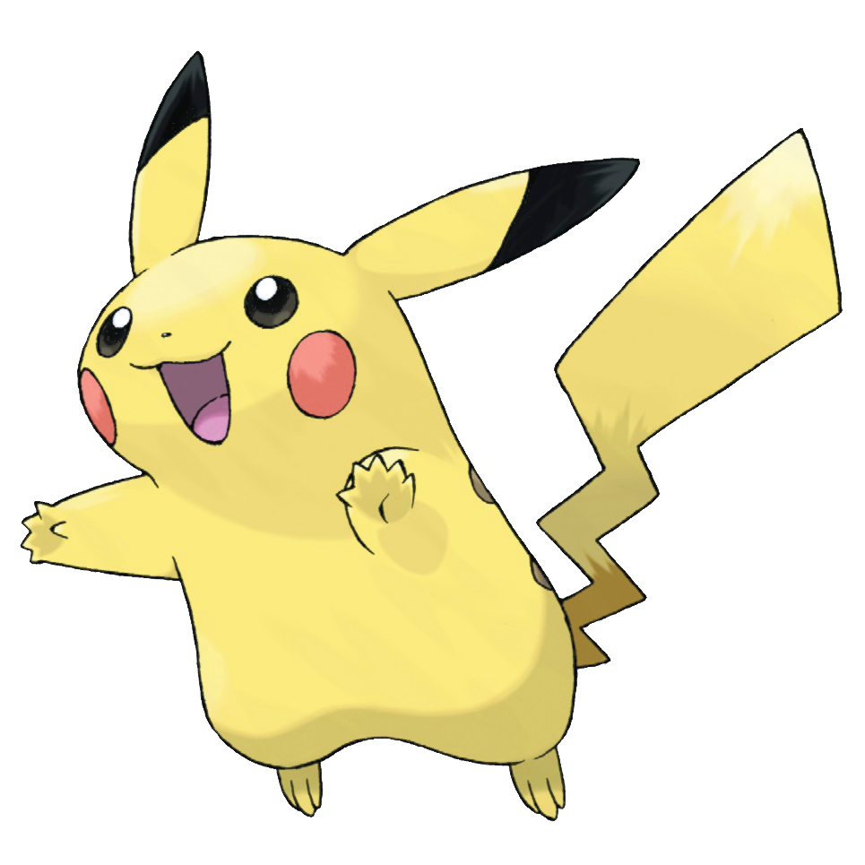
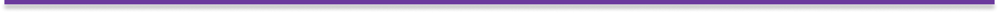
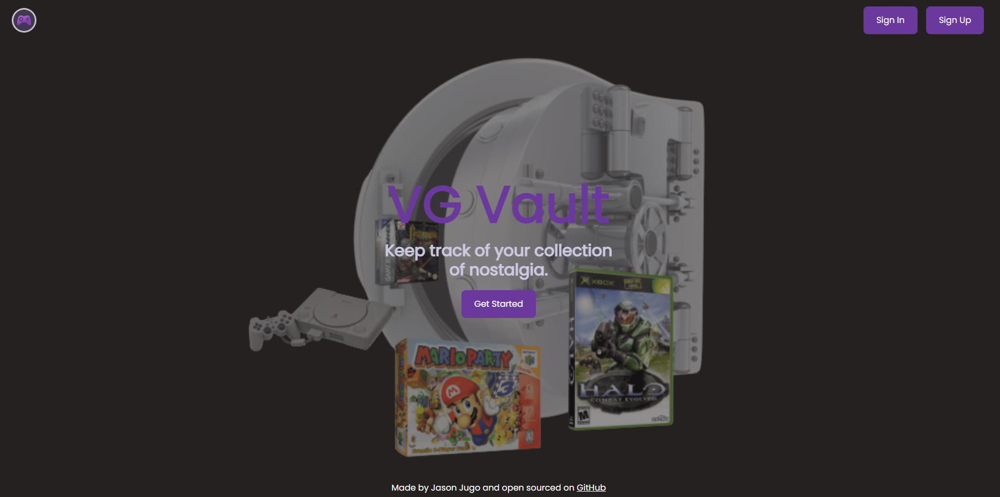

<h1 align="center">
  
</h1>

  Keep track of your video game collectibles!  
   
   
  <a href="#"><strong>Link to project</strong></a>
  ·
  <a href="https://github.com/HondaChan14/VG-Vault/issues">Request an issue</a>
  ·
  <a href="https://github.com/HondaChan14">Contact us!</a>

 
 

<table>
  <tr>
    <td valign="top" style="width:30%">
      

  
Table of Contents

  - [About](#-about)
  - [Built With](#-built-with)

  

    </td>
    <td valign="top" style="width:70%"></td>
  </tr>
</table>

 
 

  

# 📢 About

VG Vault is a new app designed for video game collectors. To search through video games / consoles to add them to your profile to keep track of your collection.

 

  

# ✅ Built With

  <table>
    <tr>
      <td valign="center">
      
      
      </td>
      <td valign="center">
       
       
      </td>
      <td valign="center">
       
       
      </td>
    </tr>
  </table>

(<a href="#top">back to top</a>)

  

